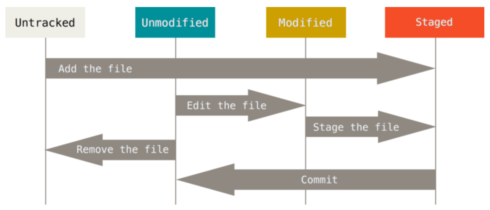

# Git commands

## Git Basics
| Type  | Description                           | Command                                          |
| ----- | ------------------------------------- | ------------------------------------------------ |
| Basic | Start a git repository                | `$ git init`                                     |
| Basic | Includes a file in stage              | `$ git add <FILE>`                               |
| Basic | Inclides files in state to git base   | `$ git commit -m <MESSAGE>`                      |
| Basic | Clone a repository                    | `$ git clone https://github.com/libgit2/libgit2` |
| Basic | Check status of files                 | `$ git status [-S:Simplified]`                   |
| Basic | Check change differences not prepated | `$ git diff`                                     |
| Basic | Check change differences in stage     | `$ git diff --staged`                            |

## Configuration commands
| Type   | Description                        | Command                                           |
| ------ | ---------------------------------- | ------------------------------------------------- |
| Config | Configure vscode as default editor | `$ git config --global core.editor "code --wait"` |
| Config | Configure emacs as default editor  | `$ git config --global core.editor emacs`         |
| Config | Enable git colors                  | `$ git config --global color.ui true`             |
| Config | Configure commit user x user       | `$ git config --global user.name`                 |
| Config | Configure commit email x user      | `$ git config --global user.email`                |
| Config | Open configurations in editor      | `$ git config -e`, `$ git config --global -e`     |
| Config | List all config properties         | `$ git config -l`, `$ git config --local -l`      |

## Commands related with branch handling
| Type    | Description                                                      | Command                                                   |
| ------- | ---------------------------------------------------------------- | --------------------------------------------------------- |
| Branch  | Rename current branch                                            | `$ git branch -m new-name`                                |
| Branch  | Rename other branch                                              | `$ git branch -m old-name new-name`                       |
| Branch  | Push renamed branch                                              | `$ git push origin :old-name new-name`                    |
| Branch  | Delete local branch                                              | `$ git branch -d [-D to force] <branch_name>`             |
| Branch  | Delete remote branch                                             | `$ git push -d [-D to force] <remote_name> <branch_name>` |
| Branch  | Display all branches                                             | `$ git branch -a`                                         |
| Branch  | List all branches that have been merged into the current branch. | <code>$ git branch --merged</code>                        |
| Branch  | List references that could be deleted from local                 | `$ git remote prune origin --dry-run`                     |
| Branch  | Delete references not present on remote                          | `$ git remote prune origin`                               |
| Remotes | List all remotes configured                                      | `$ git remote -v `                                        |
| Remotes | Display url of remote `origin`                                   | `$ git remote get-url origin`                             |
| Remotes | Add a remote reference to our repo                               | `$ git remote add <remote-reference-name> <remote-url>`   |
| Remotes | Delete a remote reference from our repo                          | `$ git remote remove <remote-reference-name>`             |
| Remotes | Rename a remote reference                                        | `$ git remote rename <old-name> <new-name>`               |

## Commands related with git logs
| Type | Description            | Command                                                               |
| ---- | ---------------------- | --------------------------------------------------------------------- |
| Logs | Display logs in single | `$ git log --oneline`                                                 |
| Logs | Display logs           | `$ git log --graph --decorate --pretty=oneline --abbrev-commit --all` |

## Commands related with commit handling
| Type   | Description                                   | Command                                                        |
| ------ | --------------------------------------------- | -------------------------------------------------------------- |
| Commit | Basic interactive rebase                      | `$ git rebase -i -p 0ad14fa5`                                  |
| Commit | Change last commit author                     | `$ git commit --amend --author="Hernan <NEW EMAIL>" --no-edit` |
| Commit | To revert a rebase already pushed             | `$ $ git reflog <branch>` -> `$ git push -f`                   |
| Commit | To Solve problem when new repos have problems | `$ git pull origin branchname --allow-unrelated-histories`     |

## Commands related with submodules
| Type       | Description                            | Command                                                                         |
| ---------- | -------------------------------------- | ------------------------------------------------------------------------------- |
| Submodules | Add a new submodule pointing to master | `$ git submodule add -b master <REMOTE_REPOSITORY> <FOLDER_IN_CURRENT_PROJECT>` |

## General procedures
- To change the author history  
  1. `$ git rebase -i X`
  1. `$ git commit --amend --author="<NAME> <EMAIL>" --no-edit`
  1. `$ git rebase --continue`
  1. `$ git stash save YOUR_MESSAGE`  
   
- Delete all local branches not present on remote  
     `$ git branch --merged | grep -v "master" | grep -v "develop" > /tmp/merged-branches && vi /tmp/merged-branches && xargs git branch -d < /tmp/merged-branches`

- Delete all local branches with remote branch GONE  
    `$ git fetch -p&& for branch in 'git for-each-ref --format '%(refname) %(upstream:track)' refs/heads | awk '$2 == "[gone]" {sub("refs/heads/", "", $1); print $1}'``; do git branch -D $branch; done`

- Remove submodules completely
  - `$ git submodule deinit public`
  - `$ git rm -r public`
  - `$ git commit -m "Removed submodule public"`
  - `$ rm -rf .git/modules/public`

## Additional Info
Some Tips: https://docs.plone.org/develop/coredev/docs/git.html#making-commits

### Git Cheat Sheet

### Git File States

